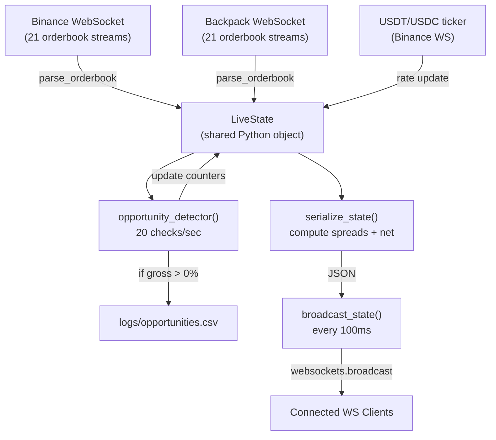

# Architecture — Real-Time Arbitrage Dashboard

> Pippin Arb Bot: Cross-exchange arbitrage monitor for **Binance ↔ Backpack**

---

## Table of Contents

- [System Overview](#system-overview)
- [Directory Structure](#directory-structure)
- [Backend Architecture](#backend-architecture)
  - [Data Flow](#data-flow)
  - [Modules & Classes](#modules--classes)
  - [Fee / Cost Model](#fee--cost-model)
  - [WebSocket Server](#websocket-server)
  - [JSON Payload Schema](#json-payload-schema)
- [Frontend Architecture](#frontend-architecture)
  - [Tech Stack](#tech-stack)
  - [State Management](#state-management)
  - [Component Tree](#component-tree)
  - [Component Specifications](#component-specifications)
- [Communication Protocol](#communication-protocol)
- [Startup & Deployment](#startup--deployment)
- [Configuration Reference](#configuration-reference)

---

## System Overview

```
┌───────────────────────────────────────────────────────────┐
│               Python Backend (ws_server.py)                │
│                                                           │
│  ┌──────────┐  ┌──────────┐  ┌─────────────────────┐     │
│  │ Binance  │  │ Backpack │  │ USDT/USDC Tracker   │     │
│  │ 21 WS    │  │ 21 WS    │  │ (rate feed)         │     │
│  │ feeds    │  │ feeds    │  └──────────┬──────────┘     │
│  └────┬─────┘  └────┬─────┘             │                │
│       │              │                   │                │
│       ▼              ▼                   ▼                │
│  ┌─────────────────────────────────────────────┐          │
│  │              LiveState (shared)             │          │
│  │  • binance{}  • backpack{}  • usdt_usdc_rate│          │
│  │  • ws_status{}  • opp_count{}  • opp_last{} │          │
│  │  • spread_history{}  • opp_best{}           │          │
│  └──────────────┬──────────────────────────────┘          │
│                 │                                         │
│    ┌────────────┴────────────┐                            │
│    ▼                         ▼                            │
│  ┌──────────────┐  ┌───────────────────┐                 │
│  │ Opportunity  │  │ broadcast_state() │                 │
│  │ Detector     │  │ 10fps → JSON      │                 │
│  │ (20 checks/s)│  └────────┬──────────┘                 │
│  │ → CSV log    │           │                            │
│  └──────────────┘           │                            │
│                             ▼                            │
│                   ws://127.0.0.1:8765                     │
└───────────────────────┬───────────────────────────────────┘
                        │
              JSON payload every 100ms
                        │
                        ▼
┌───────────────────────────────────────────────────────────┐
│             React Frontend (Vite + TypeScript)             │
│                                                           │
│  ┌─────────────────────────────────────────────────┐      │
│  │  useArbitrageSocket() hook                       │      │
│  │  • Connects to ws://127.0.0.1:8765              │      │
│  │  • Parses JSON → Zustand store                  │      │
│  │  • Auto-reconnect on disconnect                 │      │
│  └──────────────────┬──────────────────────────────┘      │
│                     ▼                                     │
│  ┌─────────────────────────────────────────────────┐      │
│  │  Zustand Store (useArbitrageStore)               │      │
│  │  • liveState: LiveState | null                  │      │
│  │  • wsStatus: ConnectionStatus                   │      │
│  │  • threshold: number (user-adjustable)          │      │
│  └──────────────────┬──────────────────────────────┘      │
│                     ▼                                     │
│  ┌─────────┬────────────────┬──────────────────────┐      │
│  │HeaderHUD│  TokenGrid     │     ActionFeed       │      │
│  │         │  └─TokenCard×21│     (sidebar)        │      │
│  │         │    └─SpreadBar │                      │      │
│  └─────────┴────────────────┴──────────────────────┘      │
└───────────────────────────────────────────────────────────┘
```

---

## Directory Structure

```
pippin_arb_bot/
├── ws_server.py              # ← Headless WebSocket backend
├── price_gap_monitor.py      # ← Original terminal-based monitor (fallback)
├── start.sh                  # ← Boot script (starts both services)
├── requirements.txt          # ← Python dependencies
├── ARCHITECTURE.md           # ← This file
├── logs/
│   └── opportunities.csv     # ← CSV log of every detected opportunity
├── frontend/                 # ← Vite React+TS dashboard
│   ├── index.html
│   ├── vite.config.ts
│   ├── package.json
│   └── src/
│       ├── main.tsx          # React entry point
│       ├── App.tsx           # Root component (layout + routing)
│       ├── types.ts          # TypeScript interfaces (mirrors backend JSON)
│       ├── store.ts          # Zustand state management
│       ├── hooks/
│       │   └── useArbitrageSocket.ts   # WebSocket connection hook
│       └── components/
│           ├── HeaderHUD.tsx           # Top status bar + threshold slider
│           ├── TokenGrid.tsx           # Category-grouped token card grid
│           ├── TokenCard.tsx           # Per-token card (prices, spread, stats)
│           ├── TokenSpreadBar.tsx      # Centered visual spread bar
│           ├── ActionFeed.tsx          # Live opportunity event log (sidebar)
│           └── WaitingScreen.tsx       # Shown when backend is disconnected
└── venv/                     # Python virtual environment
```

---

## Backend Architecture

**File:** `ws_server.py`  
**Runtime:** Python 3.12+, `asyncio` event loop (with `uvloop` if available)  
**Dependencies:** `ccxt.pro` (WebSocket orderbooks), `websockets` (broadcast server)

### Data Flow



### Modules & Classes

#### `LiveState` (class)

The central shared state object. **Not thread-safe** — relies on single-threaded asyncio.

| Attribute | Type | Description |
|-----------|------|-------------|
| `binance` | `dict[str, dict]` | Per-token orderbook: `{bid, ask, bid_depth, ask_depth, updated}` |
| `backpack` | `dict[str, dict]` | Same structure as binance |
| `usdt_usdc_rate` | `float` | Current USDT/USDC exchange rate (≈1.0) |
| `ws_status` | `dict[str, dict]` | `{"binance": {"SOL": "connected"}, "backpack": {...}}` |
| `update_count` | `dict[str, int]` | Total WS ticks received per exchange |
| `opp_count` | `dict[str, int]` | Opportunities detected per token |
| `opp_total` | `int` | Grand total opportunities |
| `opp_last` | `dict[str, dict]` | Last opportunity per token: `{time, spread, net, direction}` |
| `opp_best` | `dict[str, float]` | Best gross spread seen per token |
| `spread_history` | `dict[str, dict]` | Session high spreads: `{max_buy_bin, max_buy_bp}` |
| `started_at` | `float` | `time.monotonic()` at startup |

#### `OpportunityLogger` (class)

Async-safe CSV writer. Logs every positive gross spread with a 1-second debounce per token.

| Method | Description |
|--------|-------------|
| `_init_csv()` | Creates `logs/` directory and CSV with headers if missing |
| `log(record)` | Appends one row under an `asyncio.Lock` |

#### Coroutines

| Coroutine | Frequency | Description |
|-----------|-----------|-------------|
| `watch_binance_book(exchange, token, symbol)` | Continuous | Subscribes to Binance orderbook WS stream. Updates `state.binance[token]`. |
| `watch_backpack_book(exchange, token, symbol)` | Continuous | Same for Backpack. Updates `state.backpack[token]`. |
| `watch_usdt_usdc(exchange)` | Continuous | Tracks USDT/USDC rate via ticker. Falls back to inverse USDC/USDT. |
| `opportunity_detector()` | 20/sec | Scans all tokens for positive gross spreads. Logs to CSV, updates counters. |
| `broadcast_state(threshold)` | 10/sec | Serializes `LiveState` → JSON, broadcasts to all WS clients. |
| `ws_handler(websocket)` | On connect | Registers client in `connected_clients` set, awaits close. |

#### `parse_orderbook(ob)` → `dict`

Extracts from a ccxt orderbook object:

```python
{
    "bid": float,          # best bid price
    "ask": float,          # best ask price
    "bid_depth": float,    # sum(price × qty) for top 5 bids (USD value)
    "ask_depth": float,    # sum(price × qty) for top 5 asks (USD value)
    "updated": float,      # time.monotonic() timestamp
}
```

#### `serialize_state(threshold)` → `dict`

The core serializer. Runs every 100ms. For each token, it:

1. Reads raw bid/ask from `state.binance` and `state.backpack`
2. Converts Backpack USDC prices to USDT-equivalent using `state.usdt_usdc_rate`
3. Computes **gross spread** in both directions:
   - `spread_buy_bin = ((bp_bid_usdt - bin_ask) / bin_ask) × 100`
   - `spread_buy_bp = ((bin_bid - bp_ask_usdt) / bp_ask_usdt) × 100`
4. Computes **net spread** = gross − `TOTAL_FEES_PCT`
5. Computes data staleness as `age_ms`
6. Bundles everything into the JSON payload (see schema below)

### Fee / Cost Model

```
Total Cost = Binance Taker Fee + Backpack Taker Fee + Solana Gas
           = 0.10%             + 0.10%              + 0.01%
           = 0.21%
```

| Fee Component | Value | Notes |
|---------------|-------|-------|
| `binance_taker` | 0.10% | Binance spot taker fee (default tier) |
| `backpack_taker` | 0.10% | Backpack spot taker fee |
| `solana_gas` | 0.01% | Solana network tx fee (~$0.01/tx, estimated as % of ~$100 trade) |
| **TOTAL** | **0.21%** | Subtracted from gross spread to get net profit |

**Configured in:** `ws_server.py` → `FEES` dict  
**Used by:** `opportunity_detector()` for CSV net spread, `serialize_state()` for frontend display

### WebSocket Server

| Property | Value |
|----------|-------|
| **Protocol** | WebSocket (`ws://`) |
| **Host** | `127.0.0.1` (localhost only) |
| **Port** | `8765` (configurable via `--port`) |
| **Direction** | **Server → Client only** (unidirectional broadcast) |
| **Frequency** | Every 100ms (10fps) |
| **Format** | JSON (single stringified payload) |
| **Client tracking** | `connected_clients: set` — register on connect, discard on close |
| **Broadcast method** | `websockets.broadcast()` for efficient fan-out |

### JSON Payload Schema

Sent to all connected clients every 100ms:

```json
{
  "timestamp": "2026-04-04T06:00:00.000000+00:00",
  "uptime_seconds": 3600,
  "threshold": 1.0,

  "fees": {
    "binance_taker": 0.10,
    "backpack_taker": 0.10,
    "solana_gas": 0.01
  },
  "total_fees_pct": 0.21,

  "binance_connected": 21,
  "backpack_connected": 21,
  "total_tokens": 21,
  "update_count": { "binance": 154200, "backpack": 121030 },

  "usdt_usdc_rate": 1.000123,

  "opp_total": 47,

  "categories": {
    "💎 Big Three": ["SOL", "ETH", "BTC"],
    "🟣 Solana Core": ["JUP", "PYTH", "JTO"],
    "⚡ High Velocity": ["RENDER", "W", "DRIFT"],
    "🏗️ DePIN & Infra": ["HNT", "HONEY", "IO"],
    "🏦 Ecosystem HiCaps": ["KMNO", "TNSR", "CLOUD"],
    "🐕 Meme Liquidity": ["WIF", "BONK", "MEW"],
    "⭐ Special Pair": ["BP"],
    "🌐 Cross-Chain": ["SUI", "SEI"]
  },
  "tokens": ["SOL", "ETH", "BTC", "JUP", "PYTH", "..."],

  "token_data": {
    "SOL": {
      "category": "💎 Big Three",
      "binance": {
        "bid": 142.50,
        "ask": 142.60,
        "bid_depth": 50421.30,
        "ask_depth": 48200.10,
        "age_ms": 45,
        "status": "connected"
      },
      "backpack": {
        "bid": 143.10,
        "ask": 143.20,
        "bid_depth": 32100.50,
        "ask_depth": 29800.00,
        "age_ms": 120,
        "status": "connected"
      },
      "spread_buy_bin": 0.3504,
      "spread_buy_bp": -0.2109,
      "net_spread_buy_bin": 0.1404,
      "net_spread_buy_bp": -0.4209,
      "session_high_gross": 1.234,
      "session_high_net": 1.024,
      "opp_count": 12,
      "opp_best": 1.234,
      "opp_last": {
        "time": "14:23:05",
        "spread": 1.234,
        "net": 1.024,
        "direction": "BuyBIN→SellBP"
      }
    }
  }
}
```

#### Field Reference

| Field | Type | Description |
|-------|------|-------------|
| `timestamp` | `string` | UTC ISO-8601 timestamp |
| `uptime_seconds` | `int` | Seconds since backend started |
| `threshold` | `float` | Backend's default threshold (frontend can override locally) |
| `fees` | `object` | Itemized fee breakdown (%) |
| `total_fees_pct` | `float` | Sum of all fees (%) |
| `binance_connected` | `int` | Number of Binance WS feeds connected |
| `backpack_connected` | `int` | Number of Backpack WS feeds connected |
| `total_tokens` | `int` | Total tokens monitored (21) |
| `update_count` | `object` | Total WS ticks per exchange |
| `usdt_usdc_rate` | `float` | Current USDT/USDC exchange rate |
| `opp_total` | `int` | Total opportunities detected this session |
| `categories` | `object` | Category name → token list mapping |
| `tokens` | `string[]` | Flat ordered list of all tokens |
| `token_data` | `object` | Per-token data (see below) |

#### Per-Token `token_data[TOKEN]`

| Field | Type | Description |
|-------|------|-------------|
| `category` | `string` | Category name (e.g. "💎 Big Three") |
| `binance` / `backpack` | `object` | `{bid, ask, bid_depth, ask_depth, age_ms, status}` |
| `spread_buy_bin` | `float\|null` | **Gross %**: Buy on Binance, sell on Backpack |
| `spread_buy_bp` | `float\|null` | **Gross %**: Buy on Backpack, sell on Binance |
| `net_spread_buy_bin` | `float\|null` | **Net %**: `spread_buy_bin - total_fees` |
| `net_spread_buy_bp` | `float\|null` | **Net %**: `spread_buy_bp - total_fees` |
| `session_high_gross` | `float\|null` | Best gross spread seen this session |
| `session_high_net` | `float\|null` | Best net spread seen this session |
| `opp_count` | `int` | Opportunities detected for this token |
| `opp_best` | `float\|null` | Best gross spread ever logged |
| `opp_last` | `object\|null` | Last opportunity: `{time, spread, net, direction}` |

---

## Frontend Architecture

**Directory:** `frontend/`  
**Runtime:** Vite 8 dev server on `http://localhost:5173`

### Tech Stack

| Technology | Version | Purpose |
|------------|---------|---------|
| React | 19.x | UI rendering |
| TypeScript | 5.9 | Type safety |
| Vite | 8.x | Dev server + HMR + bundler |
| Tailwind CSS | 4.x | Utility-first styling (CSS-first config) |
| Zustand | latest | Lightweight state management (no Redux boilerplate) |
| Lucide React | latest | Icon library |

### State Management

**File:** `src/store.ts`

```
┌─────────────────────────────────────────┐
│         Zustand Store                   │
│                                         │
│  liveState: LiveState | null            │  ← Updated 10x/sec by WS hook
│  wsStatus: ConnectionStatus             │  ← 'connecting'|'connected'|'disconnected'|'error'
│  lastUpdateAt: number | null            │  ← Date.now() of last update
│  threshold: number                      │  ← User-adjustable (0.1% – 15%)
│                                         │
│  setLiveState(state) → void             │
│  setWsStatus(status) → void             │
│  setThreshold(value) → void             │  ← Clamped to [0.1, 15]
└─────────────────────────────────────────┘
```

**Key design decision:** The `threshold` lives in the Zustand store, **not** in the backend. The backend sends a default threshold in the payload, but the user can override it via the frontend slider. The backend logs ALL positive spreads to CSV regardless of threshold — the threshold only controls what the UI highlights as a profitable opportunity.

### WebSocket Hook

**File:** `src/hooks/useArbitrageSocket.ts`

| Feature | Implementation |
|---------|----------------|
| **Connect** | `new WebSocket('ws://127.0.0.1:8765')` |
| **On message** | `JSON.parse(event.data)` → `setLiveState()` |
| **Auto-reconnect** | On `close` or `error`, retry after 2 seconds |
| **Stale detection** | If no data for 3 seconds, set status to `'error'` |
| **Cleanup** | Close WS on component unmount |

### Component Tree

```
App.tsx
├── useArbitrageSocket()          ← establishes WS connection
│
├── [if no data] WaitingScreen    ← loading/disconnected state
│
└── [if data]
    ├── HeaderHUD                 ← sticky top bar
    │   ├── Logo + title
    │   ├── Threshold slider (0.1%–15%) + numeric input
    │   ├── Fee display (hover for breakdown)
    │   ├── Uptime counter
    │   ├── WS / Binance / Backpack status dots
    │   ├── Tick counters
    │   ├── USDT/USDC rate + peg deviation
    │   └── Opportunity counter
    │
    ├── TokenGrid (main area)
    │   ├── Category Section "💎 Big Three"
    │   │   ├── TokenCard (SOL)
    │   │   │   ├── TokenSpreadBar (net spread visualization)
    │   │   │   ├── Gross → Fees → Net breakdown
    │   │   │   ├── Price grid (Binance bid/ask + Backpack bid/ask)
    │   │   │   └── Footer (opp count, best spread, session high net)
    │   │   ├── TokenCard (ETH)
    │   │   └── TokenCard (BTC)
    │   ├── Category Section "🟣 Solana Core"
    │   │   └── ...
    │   └── ... (8 categories, 21 tokens total)
    │
    └── ActionFeed (right sidebar)
        └── Scrolling list of opportunity events
            └── Entry: token, direction, gross%, net%, timestamp
```

### Component Specifications

#### `App.tsx` — Root Layout

- Calls `useArbitrageSocket()` on mount
- Reads `liveState` and `wsStatus` from store
- Renders `WaitingScreen` if no data, otherwise the full dashboard
- Layout: header (sticky top) + main/aside split

#### `HeaderHUD.tsx` — Status Bar

| Section | Data Source | Logic |
|---------|-------------|-------|
| WS Status | `store.wsStatus` | Green dot if connected, yellow if connecting, red if dead |
| Binance/Backpack counts | `liveState.binance_connected` / `liveState.backpack_connected` | Green if all 21 connected, yellow if partial |
| Tick counters | `liveState.update_count.binance/backpack` | Raw update counts, formatted with commas |
| USDT/USDC rate | `liveState.usdt_usdc_rate` | Green if peg deviation < 0.05%, yellow < 0.1%, red otherwise |
| Threshold slider | `store.threshold` / `store.setThreshold` | Range: 0.1–15%, step 0.1. Label: "Min Net Profit" |
| Fee display | `liveState.total_fees_pct` | Shows `(fees: 0.21%)` with hover tooltip for breakdown |
| Opportunity counter | `liveState.opp_total` | Green if > 0, dimmed otherwise |
| Uptime | `liveState.uptime_seconds` | Formatted as `Xh XXm XXs` |

#### `TokenGrid.tsx` — Category Grid

- Reads `liveState.categories` and `liveState.token_data` from store
- Reads `threshold` from store (user-adjustable, not backend default)
- Renders a `<section>` per category with a header + separator
- Responsive grid: 1 col (mobile) → 2 (sm) → 3 (lg) → 4 (xl)

#### `TokenCard.tsx` — Per-Token Card

**Props:** `token`, `data: TokenData`, `threshold`, `totalFeesPct`

| Visual Element | Logic |
|----------------|-------|
| **Highlight border** | Card gets green glow when `bestNetSpread >= threshold` |
| **SpreadBar** | Shows **net spread** (not gross). Threshold comparison uses net. |
| **Breakdown row** | `gross: +0.45% − 0.21% = net: +0.24%` |
| **Price grid** | Binance bid/ask + Backpack bid/ask with staleness indicators |
| **Footer: opp count** | Green if > 0, dimmed otherwise |
| **Footer: session high** | Uses `session_high_net`. Green if ≥ threshold, yellow if > 0, dim otherwise |

**Opportunity highlighting logic:**
```
bestNetSpread = max(net_spread_buy_bin, net_spread_buy_bp)
isHot = bestNetSpread >= threshold
```

A card lights up green (is "hot") when the **net profit** (after exchange fees + Solana gas) exceeds the user's desired minimum profit percentage.

#### `TokenSpreadBar.tsx` — Visual Spread Bar

**Props:** `token`, `spread` (net), `threshold`

- Horizontal bar with a center zero-line
- **Positive spread** → green bar extends right from center
- **Negative spread** → red bar extends left from center
- Bar width clamped to ±2% visual max (prevents outlier layout breaks)
- **Glows** (green pulse animation) when spread ≥ threshold
- Shows `+X.XXX%` / `-X.XXX%` label

#### `ActionFeed.tsx` — Live Event Log

- Tracks changes to `token_data[*].opp_last` across renders
- When a new opportunity appears (different `time` + `direction`), prepends an entry
- Keeps last 50 entries in memory
- Each entry shows: token name, direction, gross %, net %, timestamp
- Net profit entries > 0 get a green-tinted background

#### `WaitingScreen.tsx` — Disconnected State

- Shown when `liveState` is null or `wsStatus` is disconnected/error
- Animated connecting indicator (spinner when connecting, WiFi-off when dead)
- Shows WS URL and status
- Code snippet showing how to start the backend

---

## Communication Protocol

```
Direction:  Backend ──────────→ Frontend
Protocol:   WebSocket (ws://)
Endpoint:   ws://127.0.0.1:8765
Frequency:  Every 100ms (10fps)
Format:     JSON (UTF-8 string)
Auth:       None (localhost only)
```

**There is NO communication from frontend → backend.** The WebSocket is unidirectional:

- The backend broadcasts state to all connected clients
- The frontend threshold slider is local only (stored in Zustand)
- The backend logs ALL positive spreads regardless of any threshold

### Connection Lifecycle

```
Frontend                          Backend
   │                                 │
   ├── new WebSocket(url) ──────────►│ ws_handler() adds to connected_clients
   │                                 │
   │◄── JSON payload (100ms) ────────│ broadcast_state() 
   │◄── JSON payload (100ms) ────────│
   │◄── ... (continuous) ────────────│
   │                                 │
   ├── close / error ───────────────►│ ws_handler() removes from connected_clients
   │                                 │
   │  (wait 2s)                      │
   │                                 │
   ├── new WebSocket(url) ──────────►│ auto-reconnect
   │                                 │
```

---

## Startup & Deployment

### Quick Start

```bash
./start.sh                    # starts both services
./start.sh --threshold 0.5    # custom default threshold
```

### Manual Start

```bash
# Terminal 1: Backend
source venv/bin/activate
python ws_server.py                     # default: threshold=1.0, port=8765
python ws_server.py --threshold 0.3     # custom threshold
python ws_server.py --port 9000         # custom port

# Terminal 2: Frontend
cd frontend && npm run dev              # starts Vite on http://localhost:5173
```

### Services

| Service | URL | Process |
|---------|-----|---------|
| Python backend | `ws://127.0.0.1:8765` | `python ws_server.py` |
| React frontend | `http://localhost:5173` | `npm run dev` (Vite) |

### Graceful Shutdown

`start.sh` traps `SIGINT`/`SIGTERM` and kills both PIDs. The backend prints a session summary on shutdown.

---

## Configuration Reference

### Backend (`ws_server.py`)

| Constant | Default | Description |
|----------|---------|-------------|
| `CATEGORIES` | 8 groups, 21 tokens | Token groupings for dashboard categories |
| `DEFAULT_THRESHOLD` | `1.0` | Default highlight threshold (%) |
| `WS_BROADCAST_INTERVAL` | `0.1` | Broadcast interval in seconds (10fps) |
| `FEES.binance_taker` | `0.10` | Binance spot taker fee (%) |
| `FEES.backpack_taker` | `0.10` | Backpack spot taker fee (%) |
| `FEES.solana_gas` | `0.01` | Solana network gas estimate (%) |
| `TOTAL_FEES_PCT` | `0.21` | Sum of all fees (%) |
| `OPP_MIN_SPREAD` | `0.0` | Minimum gross spread to log (logs everything) |
| `OPP_LOG_FILE` | `logs/opportunities.csv` | CSV output path |

### Frontend (`src/store.ts`)

| State | Default | Range | Description |
|-------|---------|-------|-------------|
| `threshold` | `1.0` | 0.1–15% | User's desired minimum net profit |

### CLI Arguments

| Argument | Default | Example |
|----------|---------|---------|
| `--threshold` | `1.0` | `--threshold 0.3` |
| `--port` | `8765` | `--port 9000` |
