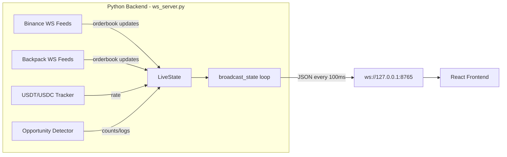

# Real-Time Arbitrage Dashboard — Phase 1 & 2 Implementation Plan

Convert the terminal-based `price_gap_monitor.py` into a split-architecture app: a **headless Python WebSocket server** + a **React/TypeScript dashboard**. This plan covers **Phase 1** (scaffolding) and **Phase 2** (backend refactor).

---

## Current State

| Item | Status |
|------|--------|
| Python venv | ✅ Exists at `./venv` |
| `ccxt` 4.5.46 | ✅ Installed |
| `uvloop` 0.19.0 | ✅ Installed |
| `websockets` 16.0 | ✅ Installed |
| Node.js v22.22.2 / npm 10.9.7 | ✅ Available |
| Vite frontend scaffold (`./frontend`) | ✅ Created (`react-ts` template) |
| `npm install` (base deps) | ⏳ Running / needs completion |

---

## Phase 1: Environment & Scaffolding

### 1.1 — Complete Frontend Dependency Install

> [!NOTE]
> The Vite scaffold is already in place. We need to install the additional UI dependencies.

```bash
cd frontend && npm install tailwindcss @tailwindcss/vite lucide-react zustand
```

**What each package does:**

| Package | Purpose |
|---------|---------|
| `tailwindcss` | Utility-first CSS framework (v4 — no config file needed) |
| `@tailwindcss/vite` | Vite plugin for Tailwind v4 |
| `lucide-react` | Icon library (connection status dots, category icons) |
| `zustand` | Lightweight state manager for high-frequency 10fps updates |

### 1.2 — Configure Tailwind CSS v4

Since Tailwind v4 uses a CSS-first config approach, we:

#### [MODIFY] [vite.config.ts](file:///home/akhilva/pippin_arb_bot/frontend/vite.config.ts)

Add `@tailwindcss/vite` plugin:

```diff
 import { defineConfig } from 'vite'
 import react from '@vitejs/plugin-react'
+import tailwindcss from '@tailwindcss/vite'

 export default defineConfig({
-  plugins: [react()],
+  plugins: [react(), tailwindcss()],
 })
```

#### [MODIFY] [index.css](file:///home/akhilva/pippin_arb_bot/frontend/src/index.css)

Replace entirely with Tailwind v4 import + custom theme:

```css
@import "tailwindcss";

/* Custom theme for the dark arbitrage dashboard */
@theme {
  --color-surface: #0a0a0f;
  --color-card: #111118;
  --color-card-hover: #16161f;
  --color-border: #1e1e2a;
  --color-spread-positive: #22c55e;
  --color-spread-negative: #ef4444;
  --color-spread-opportunity: #4ade80;
  --color-accent: #6366f1;
  --font-mono: 'JetBrains Mono', 'Fira Code', monospace;
}
```

### 1.3 — Update Python `requirements.txt`

#### [MODIFY] [requirements.txt](file:///home/akhilva/pippin_arb_bot/requirements.txt)

Add `websockets` to the deps list:

```diff
 ccxt==4.3.30
+websockets>=16.0
 aiohttp==3.9.5
```

---

## Phase 2: Refactor Python Backend

### 2.1 — Architecture Overview



### 2.2 — File Strategy

> [!IMPORTANT]
> We will **NOT modify** the original `price_gap_monitor.py`. Instead, we create a **new file** `ws_server.py` that contains the refactored headless backend. This preserves the original terminal monitor as a fallback.

#### [NEW] [ws_server.py](file:///home/akhilva/pippin_arb_bot/ws_server.py)

This file is a refactored copy of `price_gap_monitor.py` with the following changes:

**Removed (terminal/display code):**
- All ANSI color constants (`RESET`, `BOLD`, `RED`, `GREEN`, etc.)
- `clear_screen()` function
- `format_price()` function
- `format_spread()` function
- `staleness_indicator()` function
- `display_loop()` function (entire 170-line function)
- All `print()` statements in `main()` (except minimal startup logging)

**Kept as-is:**
- `CATEGORIES`, `TOKENS`, `TOKEN_CATEGORY` dicts
- `BINANCE_PAIRS`, `BACKPACK_PAIRS` mappings
- `LiveState` class
- `OpportunityLogger` class
- `parse_orderbook()` function
- `watch_binance_book()`, `watch_backpack_book()`, `watch_usdt_usdc()` coroutines
- `opportunity_detector()` coroutine
- `OPP_COLUMNS`, CSV logging

**Added (WebSocket broadcast):**

1. **`connected_clients: set`** — Global set of active WebSocket connections.

2. **`ws_handler(websocket)`** — Handles new client connections:
   ```python
   async def ws_handler(websocket):
       connected_clients.add(websocket)
       try:
           await websocket.wait_closed()
       finally:
           connected_clients.discard(websocket)
   ```

3. **`serialize_state() -> dict`** — Converts `LiveState` into a JSON-safe dictionary:
   ```python
   def serialize_state() -> dict:
       """Convert LiveState to a JSON-serializable dict."""
       payload = {
           "timestamp": datetime.now(timezone.utc).isoformat(),
           "usdt_usdc_rate": state.usdt_usdc_rate,
           "update_count": state.update_count,
           "opp_total": state.opp_total,
           "opp_count": state.opp_count,
           "opp_best": state.opp_best,
           "opp_last": state.opp_last,  # already plain dicts
           "uptime_seconds": int(time.monotonic() - state.started_at),
           "categories": CATEGORIES,
           "tokens": TOKENS,
           "ws_status": state.ws_status,
           "binance": {},   # per-token {bid, ask, bid_depth, ask_depth, age_ms}
           "backpack": {},  # per-token {bid, ask, bid_depth, ask_depth, age_ms}
       }
       now = time.monotonic()
       for token in TOKENS:
           for exch, data in [("binance", state.binance), ("backpack", state.backpack)]:
               d = data.get(token, {})
               payload[exch][token] = {
                   "bid": d.get("bid"),
                   "ask": d.get("ask"),
                   "bid_depth": round(d.get("bid_depth", 0), 2),
                   "ask_depth": round(d.get("ask_depth", 0), 2),
                   "age_ms": int((now - d["updated"]) * 1000) if d.get("updated") else None,
               }
       return payload
   ```

4. **`broadcast_state()`** — Async loop broadcasting at 10fps:
   ```python
   async def broadcast_state():
       """Broadcast LiveState JSON to all connected WebSocket clients at 10fps."""
       while True:
           if connected_clients:
               payload = json.dumps(serialize_state())
               # Use websockets.broadcast for efficient fan-out
               websockets.broadcast(connected_clients, payload)
           await asyncio.sleep(0.1)
   ```

5. **Updated `main()`** — Starts WebSocket server alongside exchange feeds:
   ```python
   async def main():
       binance = ccxt.binance({"options": {"defaultType": "spot"}})
       backpack = ccxt.backpack()

       # Start WebSocket server
       server = await websockets.serve(ws_handler, "127.0.0.1", 8765)
       print(f"[ws_server] WebSocket server running on ws://127.0.0.1:8765")

       tasks = []
       # ... same orderbook/opportunity tasks as before ...
       tasks.append(asyncio.create_task(broadcast_state()))

       try:
           await asyncio.gather(*tasks)
       finally:
           server.close()
           await binance.close()
           await backpack.close()
   ```

### 2.3 — JSON Payload Schema

Every 100ms, each connected client receives this JSON:

```json
{
  "timestamp": "2026-04-04T05:15:00.000Z",
  "usdt_usdc_rate": 1.000123,
  "update_count": { "binance": 15420, "backpack": 12103 },
  "uptime_seconds": 3600,
  "opp_total": 47,
  "opp_count": { "SOL": 12, "ETH": 8, "BTC": 3, ... },
  "opp_best": { "SOL": 1.234, "ETH": 0.876, ... },
  "opp_last": {
    "SOL": { "time": "14:23:05", "spread": 1.234, "net": 1.034, "direction": "BuyBIN→SellBP" }
  },
  "categories": {
    "💎 Big Three": ["SOL", "ETH", "BTC"],
    "🟣 Solana Core": ["JUP", "PYTH", "JTO"],
    ...
  },
  "tokens": ["SOL", "ETH", "BTC", ...],
  "ws_status": {
    "binance": { "SOL": "connected", "ETH": "connected", ... },
    "backpack": { "SOL": "connected", "ETH": "error:timeout", ... }
  },
  "binance": {
    "SOL": { "bid": 142.5, "ask": 142.6, "bid_depth": 50421.3, "ask_depth": 48200.1, "age_ms": 45 },
    ...
  },
  "backpack": {
    "SOL": { "bid": 143.1, "ask": 143.2, "bid_depth": 32100.5, "ask_depth": 29800.0, "age_ms": 120 },
    ...
  }
}
```

### 2.4 — Boot Script

#### [NEW] [start.sh](file:///home/akhilva/pippin_arb_bot/start.sh)

A single script to launch both services:

```bash
#!/bin/bash
# Start the Python WebSocket backend and React dev server

# Start Python backend in background
source venv/bin/activate
python ws_server.py &
PYTHON_PID=$!

# Start React frontend
cd frontend && npm run dev &
VITE_PID=$!

# Trap Ctrl+C to kill both
trap "kill $PYTHON_PID $VITE_PID 2>/dev/null; exit" SIGINT SIGTERM
echo "🚀 Backend PID=$PYTHON_PID | Frontend PID=$VITE_PID"
echo "   Dashboard: http://localhost:5173"
echo "   WebSocket: ws://127.0.0.1:8765"
wait
```

---

## Files Changed Summary

| File | Action | Description |
|------|--------|-------------|
| [ws_server.py](file:///home/akhilva/pippin_arb_bot/ws_server.py) | **NEW** | Headless Python backend with WebSocket broadcast |
| [start.sh](file:///home/akhilva/pippin_arb_bot/start.sh) | **NEW** | Boot script for both services |
| [requirements.txt](file:///home/akhilva/pippin_arb_bot/requirements.txt) | **MODIFY** | Add `websockets>=16.0` |
| [vite.config.ts](file:///home/akhilva/pippin_arb_bot/frontend/vite.config.ts) | **MODIFY** | Add Tailwind v4 Vite plugin |
| [index.css](file:///home/akhilva/pippin_arb_bot/frontend/src/index.css) | **MODIFY** | Replace with Tailwind v4 + dark theme tokens |
| [price_gap_monitor.py](file:///home/akhilva/pippin_arb_bot/price_gap_monitor.py) | **UNCHANGED** | Original terminal monitor preserved as fallback |

---

## Open Questions

> [!IMPORTANT]
> **1. Backpack API keys:** Does `ws_server.py` need API keys for Backpack, or are the public orderbook WebSocket feeds sufficient? The current `price_gap_monitor.py` uses `ccxt.backpack()` without credentials — is that working correctly?

> [!IMPORTANT]
> **2. Threshold config:** The current `price_gap_monitor.py` accepts `--threshold` via CLI args. Should `ws_server.py` also accept this, or should it be hardcoded / configurable from the frontend?

---

## Verification Plan

### Automated Tests
1. **Python backend starts cleanly:**
   ```bash
   source venv/bin/activate && timeout 10 python ws_server.py
   ```
   Expect: `[ws_server] WebSocket server running on ws://127.0.0.1:8765` printed, no crashes.

2. **WebSocket connection test:**
   ```bash
   python -c "
   import asyncio, websockets, json
   async def test():
       async with websockets.connect('ws://127.0.0.1:8765') as ws:
           data = json.loads(await ws.recv())
           assert 'timestamp' in data
           assert 'binance' in data
           print('✅ Received valid payload with', len(data['tokens']), 'tokens')
   asyncio.run(test())
   "
   ```

3. **Frontend builds:**
   ```bash
   cd frontend && npm run build
   ```

### Manual Verification
- Run `start.sh` and open `http://localhost:5173` — should see the Vite default page (Phase 3-4 will add the actual dashboard UI).
- Verify the Python backend logs WS connections when the frontend connects.
